# Certd Client

Certd Client 是 [Certd](https://github.com/certd/certd) 的证书部署客户端。它运行在你的应用服务器上，自动发现本机服务器上的 Nginx、Apache 和 IIS 站点，然后从 Certd 获取新证书并部署到本机。

适用于不希望服务器开放SSH、无法由 Certd 直接访问目标服务器，或同时维护多台 Windows/Linux Web 服务器的场景。

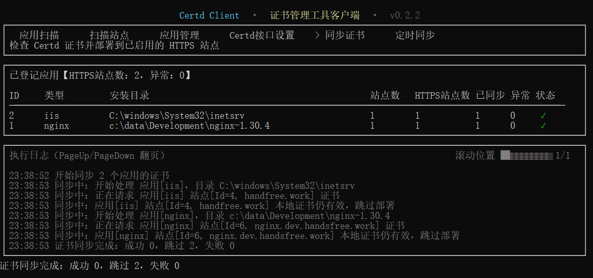


主要做两件事：1. 扫描站点 , 2. 定时同步证书。

## 定时同步证书。


## 能做什么

- 扫描本机 Nginx、Apache、IIS 安装目录和站点配置，兼容宝塔、1Panel 等常见面板环境。
- 自动识别站点域名、HTTPS 状态、配置文件和证书路径。
- 从 Certd 开放接口查询证书；缺少证书时可触发 Certd 自动申请。
- 比较远端与本地证书到期时间，只有远端证书更新时才部署，避免不必要的服务重载。
- 自动重载 Nginx、Apache，或更新 IIS 证书存储和 HTTPS 绑定，使新证书生效。
- 支持手动同步、每日定时同步和命令行自动化。
- 同步失败时汇总错误，并调用 Certd 默认通知渠道提醒管理员。
- 所有执行日志会显示在终端，同时写入 `./logs/client.log`。


  

## 支持范围

| 应用 | Windows | Linux | 说明 |
| --- | --- | --- | --- |
| Nginx | 支持 | 支持 | 扫描配置、部署证书并重载 |
| Apache | 支持 | 支持 | 扫描虚拟主机、部署证书并重载 |
| IIS | 支持 | 不适用 | 导入本机证书存储并更新 HTTPS 绑定 |

> Windows 请以管理员身份运行客户端。IIS 证书导入、服务重载和部分面板目录读取需要管理员权限。

## 安装

### Windows

在 PowerShell 中执行：

```powershell
irm https://raw.githubusercontent.com/certd/certd-client/main/scripts/install.ps1 | iex
```

脚本会提示安装目录。直接回车时，客户端安装到当前目录的 `certd-client` 子目录；再次执行同一命令会更新已有客户端。

### Linux 和 macOS

```bash
curl -fsSL https://raw.githubusercontent.com/certd/certd-client/main/scripts/install.sh | sh
```

### 确认安装

```bash
certd-client version
```

直接运行 `certd-client` 会打开终端操作界面。Windows 上请在“以管理员身份运行”的终端中执行。

## 使用前准备

在开始同步前，需要确认：

1. 已部署 [Certd 证书自动化管理系统](https://github.com/certd/certd)。 
2. 已导入域名
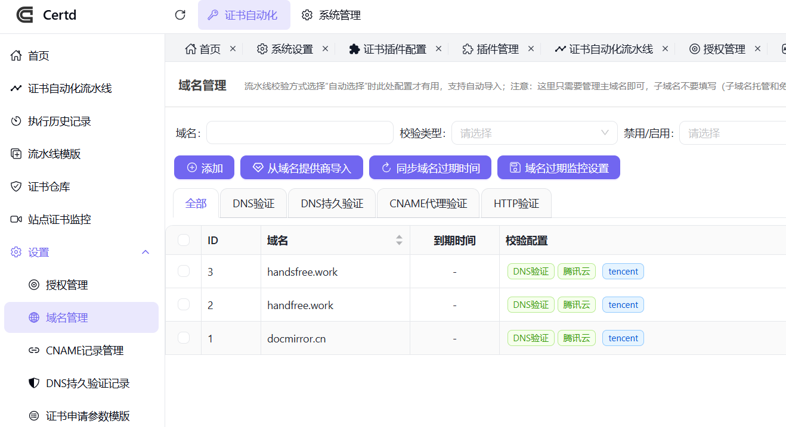

## 快速开始

首次使用按以下顺序操作：扫描应用、扫描站点、确认站点、配置 Certd 接口、同步证书。


### 1. 扫描应用

选择“应用扫描”，输入一个包含 Web 服务安装目录的根目录，例如 Windows 的 `C:\data`、`C:\www`，或 Linux 的 `/www`、`/usr/local`。

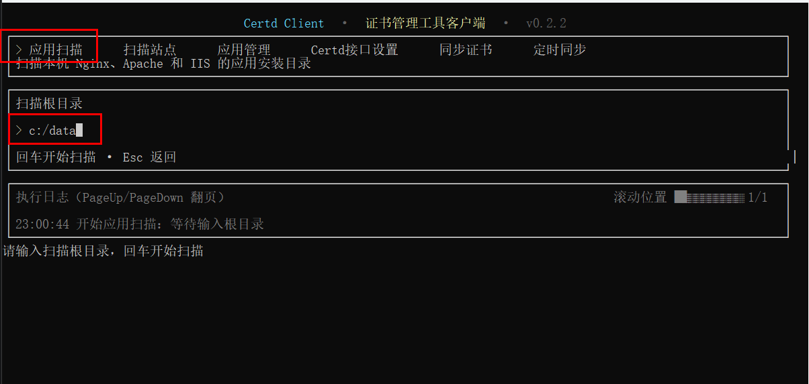

目录较大时，扫描会在后台进行，界面仍可响应键盘。日志每 10 秒报告已扫描和待扫描目录数量；没有权限或在扫描过程中消失的目录会跳过，不会中断整个扫描。

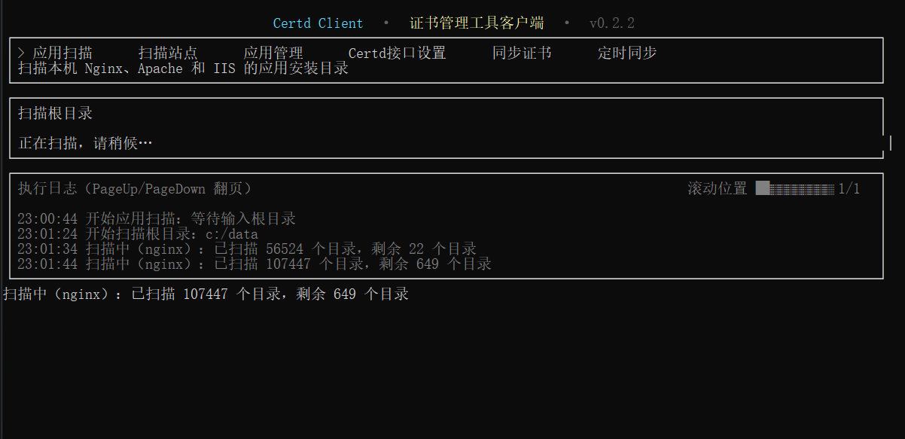

扫描完成后，用上下键移动，按空格勾选需要登记的应用，按 Enter 保存。已登记的相同路径会更新原记录；Windows 比较路径时不区分大小写。

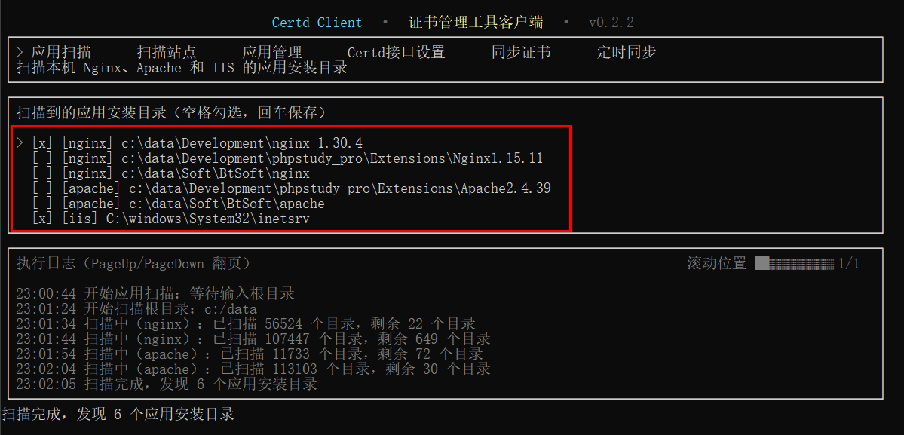

### 2. 扫描站点

选择“扫描站点”。客户端会读取已启用应用的配置，发现站点域名、HTTPS 状态、配置文件和证书路径。扫描结束后，应用表会显示站点数、HTTPS 站点数、已同步数和异常数。

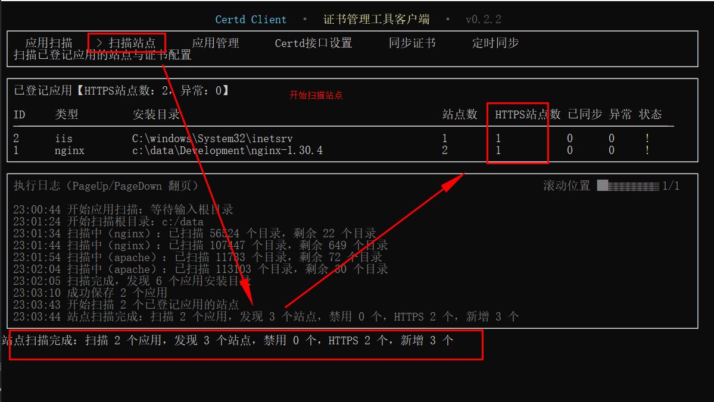

### 3. 管理应用和站点

选择“应用管理”后：

- 按 Enter 查看当前应用的站点列表。
- 按 `d` 删除应用，再按 `y` 确认。删除应用会同时删除关联站点。
- 在站点列表中按空格启用或禁用站点。

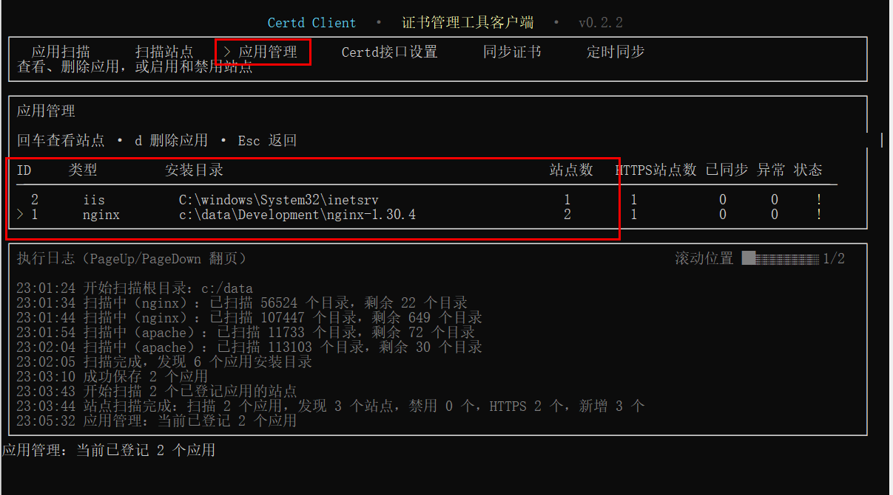

禁用的站点不会参与证书同步，也不会计入站点和 HTTPS 站点统计。建议禁用测试域名、默认站点或不希望由客户端管理的站点。

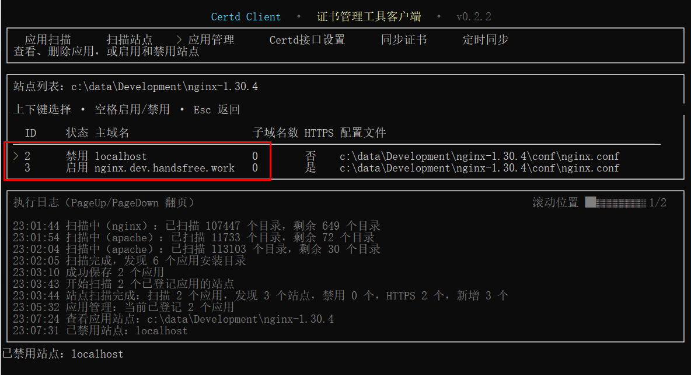

### 4. 配置 Certd 接口

在主界面选择“Certd接口设置”，填写：

- `BaseURL`：Certd 服务地址，例如 `https://certd.example.com`。
- `KeyId`、`KeySecret`：Certd 开放接口凭据。
- 本机名称：可选。填写后会附加到失败通知标题中，便于区分服务器。
- 最长等待时长：等待证书申请完成的最长时间，默认 10 分钟。

按 Tab 或上下键切换输入框，按 Enter 保存。

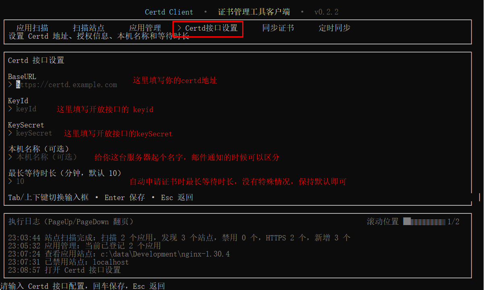


### 5. 同步证书

选择“同步证书”。客户端只会处理已启用的 HTTPS 站点，执行过程如下：

1. 向 Certd 请求站点域名对应的证书。
2. 若证书正在申请，按 10 秒间隔持续查询，直到达到设置的最长等待时间。
3. 比较远端与本地证书有效期。本地证书仍有效时跳过部署。
4. 远端证书较新时写入证书，并重载 Nginx、Apache 或更新 IIS 绑定。
5. 验证部署结果，更新应用表中的已同步数和异常数。

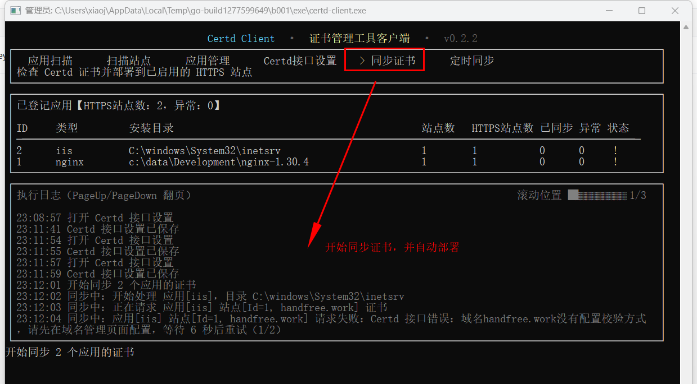

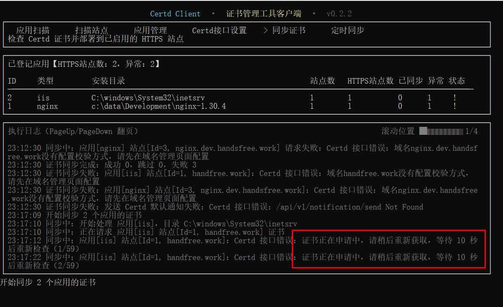

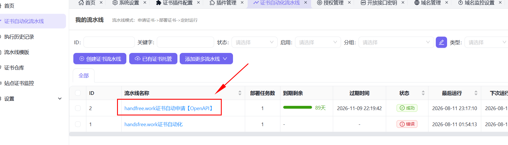

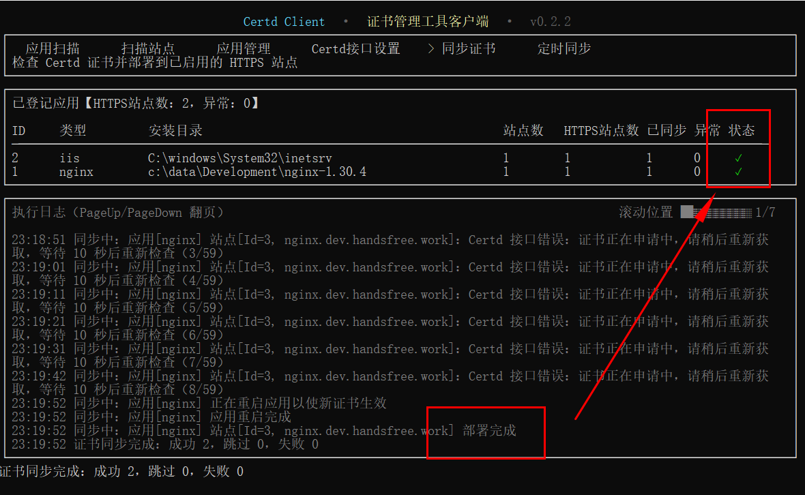

同步日志会包含应用类型、站点 ID 和域名。同步期间按 Esc 可以取消后续请求、部署和通知操作。

### 6. 启动定时同步

在主界面选择“定时同步”并按 Enter，客户端会退出 TUI 并自动进入 `start` 模式：立即完成一轮站点扫描和证书同步，随后每天在启动时刻再次执行。


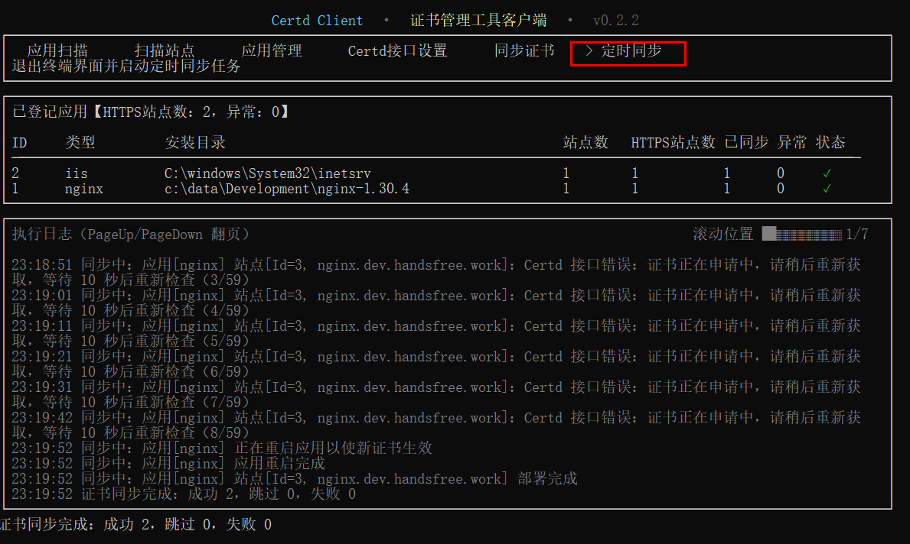

终端会持续显示扫描、同步、执行总结和下一次执行时间。按 Ctrl+C 可停止定时任务。

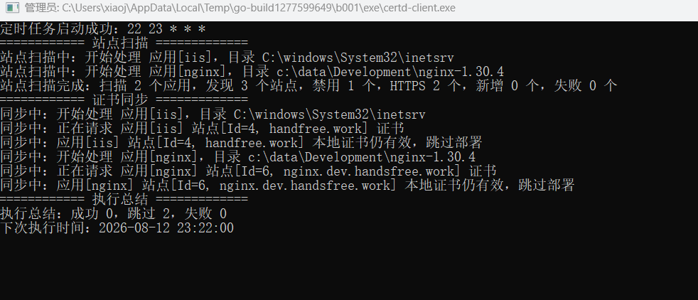

也可直接通过命令行启动：

```bash
# 立即执行一次，之后每天在启动时刻执行
certd-client start

# 每天 02:30 执行
certd-client start --cron "30 2 * * *"
```

`--cron` 使用五段 Cron 表达式：`分 时 日 月 周`。

## 日常操作参考

| 操作 | 方法 |
| --- | --- |
| 只执行一次扫描和同步 | `certd-client sync` 或 TUI 的“扫描站点”后选择“同步证书” |
| 持续每日同步 | TUI 的“定时同步”或 `certd-client start` |
| 修改执行时刻 | 使用 `certd-client start --cron "分 时 日 月 周"` |
| 查看运行日志 | 终端中按 PageUp/PageDown，或查看 `./logs/client.log` |
| 查看和禁用站点 | TUI 的“应用管理”，进入站点列表后按空格 |
| 更新客户端 | 重新执行对应系统的安装命令 |

客户端数据库默认保存在 `./data/certd-client.db`。

## 常见问题

### Windows 提示没有权限或无法读取 IIS、宝塔目录

请关闭当前终端，并以“管理员身份运行”启动 PowerShell 或 Windows Terminal 后再次执行客户端。客户端会在 Windows 上请求 UAC 提权，但受限环境仍可能需要从管理员终端启动。

### 扫描很慢，或日志显示权限不足、目录不存在

扫描大目录需要时间。建议把扫描根目录限定到应用可能所在的磁盘或面板目录。

### 没有扫描到应用或站点

确认应用根目录已经登记且处于启用状态，然后重新执行“扫描站点”。Nginx 会递归解析 `nginx.conf` 中的 `include`；如果配置在非标准位置，请确认它被主配置文件引用。

### 证书一直显示“正在申请中”

客户端会每 10 秒向 Certd 重新查询。请检查 Certd 域名管理中是否已配置域名校验方式、自动化流水线是否可用，以及接口设置中的最长等待时长是否足够。

### 为什么显示“本地证书仍有效，跳过部署”

这是正常行为。只有 Certd 返回的证书有效期晚于本地证书时才会部署，避免无意义的服务重载。

### 同步失败后在哪里看详细原因

查看终端执行日志或 `./logs/client.log`。日志包含应用类型、站点 ID 和域名。若 Certd 已配置默认通知渠道，客户端还会发送失败摘要通知。

### 如何停止定时同步

在运行 `start` 的终端按 Ctrl+C。Linux 服务管理器中运行时，请停止对应服务或发送 `SIGTERM`。

## 联系作者与反馈

- 使用问题、功能建议和缺陷反馈：[GitHub Issues](https://github.com/certd/certd-client/issues)
- 代码仓库：[certd/certd-client](https://github.com/certd/certd-client)
- 作者邮箱：[xiaojunnuo@qq.com](mailto:xiaojunnuo@qq.com)

反馈问题时，请提供操作系统、客户端版本、应用类型、站点 ID，以及脱敏后的 `./logs/client.log` 相关片段，便于快速定位。
